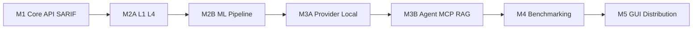

# AgentArmor — Master Plan (7 Milestones)

> **Vision, The Nuclei of AI Security — continuous testing of LLM APIs, local models, agents, MCP servers, and RAG systems.

## How to Use These Plans

Build **one milestone at a time**. Each plan is self-contained with its own Definition of Done. Do not start the next milestone until the current one passes its checklist.

Sub-milestones (M2A, M2B, M3A, M3B) reduce risk — you always have something shippable between steps.

| Plan | File | Goal | Shippable outcome |
|------|------|------|-------------------|
| **M1** | [agentarmor-plan-01-core-api-sarif.md](agentarmor-plan-01-core-api-sarif.md) | Foundation + API scan + SARIF | `pip install` → scan API → SARIF → GitHub Action |
| **M2A** | [agentarmor-plan-02-detection-foundation.md](agentarmor-plan-02-detection-foundation.md) | Rust L1 + L4 structural | Fast offline detection; stub replaced |
| **M2B** | [agentarmor-plan-03-detection-ml.md](agentarmor-plan-03-detection-ml.md) | DeBERTa + FAISS + Meta + Judge | Full ML pipeline + detection API |
| **M3A** | [agentarmor-plan-04-scanners-provider-local.md](agentarmor-plan-04-scanners-provider-local.md) | Provider + Local model scanners | Scan OpenAI/Claude + offline `.gguf`/HF |
| **M3B** | [agentarmor-plan-05-scanners-modules.md](agentarmor-plan-05-scanners-modules.md) | Agent + MCP + RAG | Enterprise-grade agent/MCP/RAG security |
| **M4** | [agentarmor-plan-06-benchmarking.md](agentarmor-plan-06-benchmarking.md) | Model benchmarking | `agentarmor benchmark --suite owasp` → leaderboards |
| **M5** | [agentarmor-plan-07-gui-distribution.md](agentarmor-plan-07-gui-distribution.md) | Desktop + distribution | Tauri GUI, Windows `.exe`, Docker, PyPI |

## Build Order



## Why This Order

| Change | Rationale |
|--------|-----------|
| **M2 split (A/B)** | M2A ships Rust L1 + L4 quickly; M2B adds heavy ML without blocking scans |
| **M3 split (A/B)** | Local model scanning is simpler than MCP; users get offline `.gguf` scans sooner |
| **M4 Benchmarking** | High marketing value — model comparisons, content, GitHub stars, enterprise model selection |
| **M5 GUI last** | All scan modes + benchmark stable before packaging desktop |

## Product Architecture (Target End State)

```
AgentArmor.exe / pip / Docker / GitHub Action
        │
        ▼
AgentArmor Core (Python 3.12)
        │
   ┌────┴────┬──────────┬──────────┬──────────┐
   ▼         ▼          ▼          ▼          ▼
 Engines   Modules   Detection  Benchmark  Reporting
 (6 types) (Agent/   (L1-L5 +   (OWASP     (HTML/JSON/
           MCP/RAG)   meta)      suites)    SARIF/PDF)
```

## Distribution Channels (Complete after M5)

| Channel | Milestone |
|---------|-----------|
| `pip install agentarmor` | M1 (basic) → M3A (`[local]` extra) |
| GitHub Action + SARIF | M1 |
| Detection L1 + L4 | M2A |
| Detection API + full ML | M2B |
| Provider + Local model scans | M3A |
| Agent / MCP / RAG scans | M3B |
| `agentarmor benchmark` | M4 |
| Windows `.exe` (installer + portable) | M5 |
| Docker image `agentarmor/agentarmor` | M5 |

## Monorepo Layout (grows each milestone)

```
AgentArmor/
├── plans/                          ← you are here
├── pyproject.toml
├── AgentArmor.toml
├── agentarmor/                     # Python package
├── probes/ detectors/ reporters/   # plugin drop-ins
├── native/l1_signatures/           # M2A
├── benchmarks/                     # M4 — OWASP suites, probe sets
├── gui/                            # M5
├── packaging/                      # M5
├── docker/                         # M5
├── action/                         # M1 → M5 publish
└── tests/
```

## OWASP Coverage Timeline

| OWASP | Milestone |
|-------|-----------|
| LLM01 Prompt Injection | M1 (probes) + M2A/M2B (detection) |
| LLM02 Sensitive Info Disclosure | M1 + M2 |
| LLM05 Improper Output Handling | M2B |
| LLM06 Excessive Agency | M3B (Agent module) |
| LLM09 Overreliance | M2B + M4 (benchmark) |
| LLM03–04, LLM07–08, LLM10 | Post-MVP Phase 2 |

## When to Execute

Say **"execute Milestone 1"** or **"execute M2A"**, **"execute M3A"**, etc. to start building that plan only.
