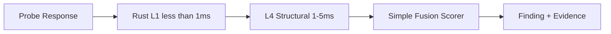

# AgentArmor Plan 02 — Milestone 2A: Detection Foundation (L1 + L4)

**Depends on:** [Milestone 1](agentarmor-plan-01-core-api-sarif.md) complete  
**Unlocks:** [Milestone 2B](agentarmor-plan-03-detection-ml.md)  
**Estimated effort:** ~1 week

## Goal

Replace the rule-based detection **stub** with a **working fast path**: Rust L1 signatures + Python L4 structural analysis. Scans immediately get better findings without waiting for ML models.

**Risk reduction:** Ship something working before DeBERTa, FAISS, and XGBoost land in M2B.

## Shippable Outcome

```bash
agentarmor scan --url http://localhost:8000/v1/chat
# Findings now scored by L1 (Rust) + L4 (structural) + simple fusion scorer
```

L1 latency < 1ms. L4 latency 1–5ms. Total detection per response < 10ms.

---

## Scope

### In scope
- Rust + PyO3 L1 signature engine (`native/l1_signatures/`)
- L4 structural analysis (entropy, prompt echo, boundary violations, instruction hierarchy)
- **Simple fusion scorer** (weighted L1 + L4 → risk, severity, PASS/WARN/FAIL) — placeholder until XGBoost in M2B
- Remove `detection/stub.py`; wire partial pipeline into scan flow
- Store per-layer scores in `findings.metrics` JSON
- Update SARIF with `properties.detection_layers`
- `cargo test` + L1 golden-file tests
- OWASP tags: LLM01, LLM02 (via L1 signatures)

### Out of scope (M2B)
- DeBERTa ONNX (L2)
- FAISS semantic search (L3)
- XGBoost meta scorer
- L5 Judge
- Detection API `/v1/detection/*`
- Model download manager

---

## Detection Flow (M2A)



**Simple fusion (temporary):**
```python
risk = 0.6 * l1_score + 0.4 * l4_score
# Map risk → severity → PASS/WARN/FAIL with fixed thresholds
```

M2B replaces `Fusion` with XGBoost meta and inserts L2/L3/L5.

---

## File Checklist

```
native/l1_signatures/
├── Cargo.toml
├── src/lib.rs
└── pyproject.toml              # maturin

agentarmor/detection/
├── pipeline.py                   # M2A: L1 → L4 → fusion only
├── l1_signatures/                # PyO3 wrapper
├── l4_structural/
│   ├── entropy.py
│   ├── echo.py
│   ├── boundary.py
│   └── hierarchy.py
├── fusion/simple_scorer.py       # replaced by meta/xgb_scorer.py in M2B
└── __init__.py
```

---

## Implementation Steps

### Step 1 — Rust L1
- Signatures: known jailbreaks, prompt leakage, system prompt exposure, refusal bypass
- maturin build; wheel in CI
- Dev fallback: pure-Python regex (warn if Rust unavailable)

### Step 2 — L4 structural
- Entropy spike detection on output tokens
- Prompt echo: significant input substrings in output
- Boundary violations: `system`/`user` delimiter leaks
- Instruction hierarchy breaks: model follows user over system

### Step 3 — Simple fusion scorer
- Weighted combination of L1 + L4 scores
- Configurable thresholds in `AgentArmor.toml`
- Same output interface as future meta scorer: `risk_score`, `severity`, `decision`

### Step 4 — Pipeline integration
- Replace `detection/stub.py` calls in orchestrator
- Pipeline interface: `analyze(text, context) -> DetectionResult`
- Interface must remain stable for M2B to extend

### Step 5 — SARIF + SQLite
- `properties.detection_layers: { l1, l4 }` in SARIF
- `findings.metrics` stores raw layer scores

### Step 6 — Tests
- `cargo test` for Rust signatures
- Golden files: known jailbreak strings → expected L1 hits
- L4 unit tests for echo, entropy, boundary

---

## Config Additions

```toml
[detection]
l1_enabled = true
l4_enabled = true
fusion_weights = { l1 = 0.6, l4 = 0.4 }
warn_threshold = 0.4
fail_threshold = 0.7
```

---

## Definition of Done

- [ ] L1 Rust engine passes `cargo test` and integrates via PyO3
- [ ] L4 structural rules pass unit tests
- [ ] `detection/stub.py` deleted; pipeline uses L1 + L4 + fusion
- [ ] M1 scan flow unchanged from CLI; findings include L1/L4 scores
- [ ] L1 latency < 1ms per response
- [ ] SARIF includes `detection_layers` properties
- [ ] `DetectionResult` interface documented for M2B extension

## Handoff to Milestone 2B

M2B extends `pipeline.py` to insert L2, L3, L5 and replaces `fusion/simple_scorer.py` with `meta/xgb_scorer.py`. No changes to orchestrator or engine contracts.
