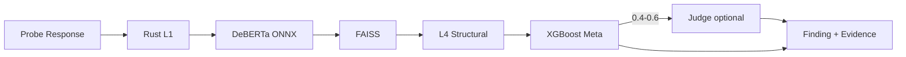

# AgentArmor Plan 03 — Milestone 2B: Detection ML (DeBERTa + FAISS + Meta + Judge)

**Depends on:** [Milestone 2A](agentarmor-plan-02-detection-foundation.md) complete  
**Unlocks:** [Milestone 3A](agentarmor-plan-04-scanners-provider-local.md)  
**Estimated effort:** ~1–2 weeks

## Goal

Complete the **ML detection stack** on top of the working L1 + L4 foundation from M2A. Add DeBERTa classifier, FAISS semantic search, XGBoost meta scorer, optional L5 judge, and the Detection API.

## Shippable Outcome

```bash
agentarmor scan --url http://localhost:8000/v1/chat   # full L1-L5 + meta pipeline
agentarmor serve
curl -X POST http://localhost:8787/v1/detection/analyze -d '{"text":"..."}'
agentarmor models download
```

---

## Scope

### In scope
- L2: DeBERTa-v3 ONNX (5 classes)
- L3: BGE-small-en-v1.5 + FAISS exploit index
- Meta: XGBoost fusing L1–L4 scores → risk, severity, decision
- L5: Optional LiteLLM judge (0.4 < confidence < 0.6)
- Replace M2A `fusion/simple_scorer.py` with `meta/xgb_scorer.py`
- Detection API at `/v1/detection/*`
- Modes: `local`, `api`, `hybrid`
- Model download manager (`~/.agentarmor/models/`)
- OWASP expansion: LLM05, LLM09

### Out of scope
- Provider / local scanners (M3A)
- Agent / MCP / RAG (M3B)
- Bundled desktop models (M5)

---

## Detection Flow (Full)



---

## File Checklist

```
agentarmor/detection/
├── pipeline.py                   # extend M2A: full L1-L5 + meta
├── l2_classifier/onnx_runner.py
├── l3_semantic/embedder.py
├── l3_semantic/faiss_index.py
├── l5_judge/judge.py
├── meta/xgb_scorer.py            # replaces fusion/simple_scorer.py
├── models/manager.py
└── api/routes.py

models/
└── README.md                     # bootstrap FAISS index + model manifests
```

---

## Implementation Steps

### Step 1 — L2 DeBERTa ONNX
- ONNX Runtime wrapper; lazy load
- Classes: prompt_injection, data_leakage, jailbreak, tool_abuse, unsafe_output

### Step 2 — L3 FAISS semantic
- BGE-small-en-v1.5 embeddings
- Pre-built exploit output index; cosine threshold scoring

### Step 3 — Meta XGBoost
- Features: L1 + L2 (5-class) + L3 + L4 scores
- Pre-trained model shipped; document retraining path

### Step 4 — L5 Judge
- LiteLLM evidence explanation only; does not override meta verdict
- Gated by `confidence_judge_band`

### Step 5 — Extend pipeline.py
- Insert L2, L3 between L1 and L4 (or parallelize L2/L3 after L1 per perf tuning)
- Swap simple fusion → XGBoost meta
- Delete `fusion/simple_scorer.py`

### Step 6 — Detection API
| Endpoint | Purpose |
|----------|---------|
| `POST /v1/detection/analyze` | Full pipeline |
| `POST /v1/detection/l1` … `l4` | Per-layer |
| `POST /v1/detection/meta` | Fuse scores |

### Step 7 — Model manager
- `agentarmor models download` / `models status`
- Checksum pinning; cache at `~/.agentarmor/models/`

### Step 8 — Tests
- Labeled sample set for severity calibration
- Full pipeline < 100ms per response on CPU

---

## Config Additions

```toml
[detection]
mode = "local"                    # local | api | hybrid
api_url = "http://127.0.0.1:8787"
confidence_judge_band = [0.4, 0.6]
model_dir = "~/.agentarmor/models"
l3_similarity_threshold = 0.82
```

---

## Definition of Done

- [ ] Full pipeline runs on labeled samples with expected severities
- [ ] XGBoost meta replaces simple fusion; thresholds calibrated
- [ ] `/v1/detection/analyze` works via `agentarmor serve`
- [ ] `local`, `api`, `hybrid` modes functional
- [ ] Models download on first run with checksum verification
- [ ] L5 judge fires only in confidence band
- [ ] SARIF includes all layer scores in `detection_layers`
- [ ] `fusion/simple_scorer.py` removed

## Handoff to Milestone 3A

M3A adds Provider + Local engines. All engines call `detection.pipeline.analyze(response)` — interface frozen here.
