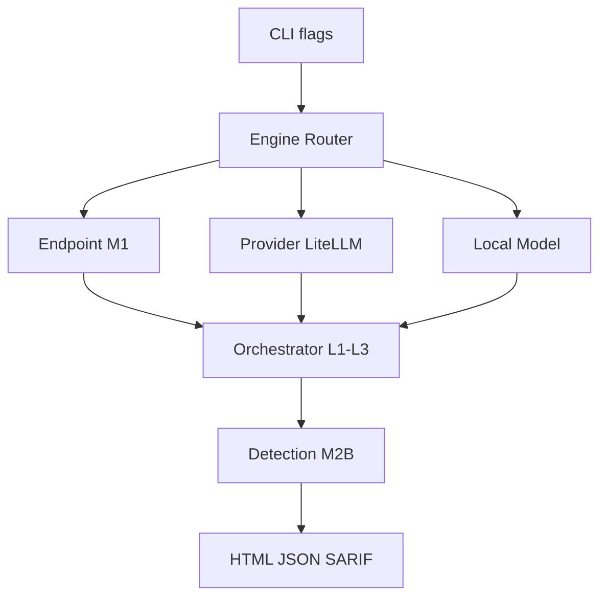

# AgentArmor Plan 04 — Milestone 3A: Provider + Local Model Scanners

**Depends on:** [Milestone 2B](agentarmor-plan-03-detection-ml.md) complete  
**Unlocks:** [Milestone 3B](agentarmor-plan-05-scanners-modules.md)  
**Estimated effort:** ~1 week

## Goal

Ship **cloud provider scanning** and **offline local model scanning** early. Local model scanning is simpler than MCP/Agent security and is a key differentiator — get users scanning `.gguf` and HuggingFace models before tackling complex agent/MCP modules.

## Shippable Outcome

```bash
# Cloud providers (LiteLLM — no provider-specific code)
agentarmor scan --provider openai
agentarmor scan --provider anthropic
agentarmor scan --provider gemini

# Local models (fully offline)
agentarmor scan --model llama-3.gguf
agentarmor scan --model ./models/qwen3

pip install agentarmor[local]
```

Plus orchestrator L2/L3 probes and HTML reporting.

---

## Scope

### In scope

#### Provider Scanner
- LiteLLM unified interface
- OpenAI, Anthropic, Gemini, Mistral, Bedrock, Azure, Groq, Together, OpenRouter
- Same `ProbeResult` contract as M1 endpoint engine

#### Local Model Scanner
| Format | Backend | Examples |
|--------|---------|----------|
| `.gguf` | `llama-cpp-python` | Llama 3, Mistral, Qwen, DeepSeek, Gemma, Phi |
| `.safetensors` / HF dir | `transformers` + CPU torch | Same families |

- `backend = auto` routes by file type
- User model never uploaded; all inference local
- `gpu_layers` config for llama.cpp

#### Orchestrator L2 + L3 (extends M1 L1)
| Layer | Probes |
|-------|--------|
| L2 Mutation | encoding, roleplay, translation, indirect injection, context-split |
| L3 Multi-turn | Crescendo, gradual escalation, TAP (simplified), GOAT (simplified) |

#### Reporting (partial)
- HTML executive + technical report (Jinja2)
- JSON + SARIF (from M1, extended)

### Out of scope (M3B)
- Agent security module
- MCP security module
- RAG security module
- PDF / CSV reports
- Tauri GUI (M5)

---

## Architecture



---

## File Checklist

```
agentarmor/engines/
├── provider/
│   ├── litellm_client.py
│   └── adapter.py
└── local/
    ├── router.py
    ├── llama_cpp_backend.py
    └── transformers_backend.py

agentarmor/orchestrator/
├── probes/l2_mutation.py
└── probes/l3_multiturn.py

agentarmor/reporting/
└── html_reporter.py
```

---

## Implementation Steps

### Step 1 — Provider engine
- LiteLLM `completion()` wrapper
- CLI `--provider openai|anthropic|gemini|...`
- Env var API keys documented in README

### Step 2 — Local model engine
- File type detection (.gguf vs HF directory)
- llama.cpp backend with `gpu_layers`, CPU default
- Transformers backend for safetensors/HF dirs
- Memory warning for models > configurable threshold

### Step 3 — Engine router
- Mutually exclusive: `--url` (M1), `--provider`, `--model`
- Config `[target] type = "provider" | "local"`

### Step 4 — Orchestrator L2/L3
- Mutation variants from L1 templates
- Multi-turn with turn cap; full conversation in findings

### Step 5 — HTML reporting
- Severity breakdown, OWASP tags, probe evidence
- Executive summary section

### Step 6 — Integration tests
- Provider: mock LiteLLM or skip without API keys in CI
- Local: tiny GGUF fixture or mocked backend

### Step 7 — pip extras
- `agentarmor[local]` → `llama-cpp-python`, `transformers`, `torch` (CPU)

---

## Config Examples

```toml
[target]
type = "provider"
provider = "anthropic"

# --- or ---

[target]
type = "local"
model = "llama-3.gguf"

[engine.local]
backend = "auto"
gpu_layers = 0
```

---

## Definition of Done

- [ ] `--provider openai` scan works with LiteLLM
- [ ] `--model *.gguf` runs offline via llama.cpp
- [ ] `--model ./hf-dir` runs via Transformers
- [ ] L2 mutation + L3 multi-turn probes run on provider and local targets
- [ ] HTML report generates with findings + OWASP tags
- [ ] `agentarmor[local]` extra documented and installable
- [ ] README: provider API key setup + local model requirements

## Handoff to Milestone 3B

M3B adds Agent, MCP, RAG modules and PDF/CSV reporting. Engine router extended with `--agent`, `--mcp`, `--rag` flags.
