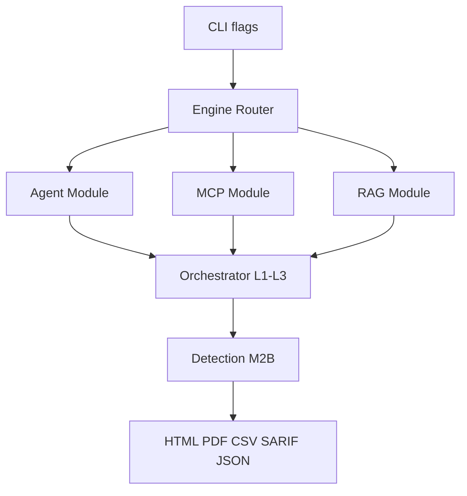

# AgentArmor Plan 05 — Milestone 3B: Agent + MCP + RAG Security Modules

**Depends on:** [Milestone 3A](agentarmor-plan-04-scanners-provider-local.md) complete  
**Unlocks:** [Milestone 4 Benchmarking](agentarmor-plan-06-benchmarking.md)  
**Estimated effort:** ~1–2 weeks

## Goal

Add the **highest enterprise-value scanners**: Agent security, MCP security, and RAG security. These are harder than provider/local scanning — build them after M3A ships.

## Shippable Outcome

```bash
agentarmor scan --agent crewai --config agent.toml
agentarmor scan --mcp ./filesystem-mcp
agentarmor scan --rag ./corpus --embedder bge
```

Plus PDF and CSV reporting. All six scan modes complete.

---

## Scope

### In scope

#### Agent Security Module
**Flow:** Prompt → Agent → Tool Calls → Memory → Response

Framework adapters (MVP): OpenAI Agents, CrewAI, LangGraph, AutoGen

| Test | Description |
|------|-------------|
| Tool abuse | Unauthorized tool invocations |
| Permission escalation | Forbidden tools invoked despite config |
| Secret extraction | Canary secrets in tool args/responses |
| Memory poisoning | Instructions persist across turns |
| Workflow hijacking | Cross-tool manipulation |

#### MCP Security Module
**Flow:** Discover Tools → Generate Attacks → Invoke Tools → Analyze

Targets: Filesystem MCP, GitHub MCP, Postgres MCP, custom MCP

| Check | Description |
|-------|-------------|
| Tool enumeration | Hidden/unlisted tools |
| Prompt injection | Via tool parameters |
| Unsafe parameters | Path traversal, SQL in args |
| Cross-tool abuse | Tool A poisons Tool B |
| Data leakage | Sensitive data in responses |

Transports: stdio, SSE, HTTP

#### RAG Security Module
- Document poisoning (injected instructions in corpus)
- Retrieval manipulation (query crafting)
- Context override (retrieved text overrides system)
- Embedding weakness (near-duplicate collisions)

#### Reporting (complete)
- PDF executive summary (WeasyPrint or reportlab)
- CSV flat export
- OWASP LLM06 mapping (Excessive Agency) via Agent module

### Out of scope
- Benchmarking (M4)
- Tauri GUI (M5)
- OWASP LLM03/04/07/08/10

---

## Architecture



---

## File Checklist

```
agentarmor/modules/
├── agent/
│   ├── runner.py
│   ├── adapters/crewai.py
│   ├── adapters/langgraph.py
│   └── probes/
├── mcp/
│   ├── client.py
│   ├── discovery.py
│   └── probes/
└── rag/
    ├── corpus.py
    ├── retriever.py
    └── probes/

agentarmor/reporting/
├── pdf_reporter.py
└── csv_reporter.py

tests/fixtures/mcp_server/
```

---

## Implementation Steps

### Step 1 — Agent module
- Generic harness: prompt → observe tool calls + memory state
- 2 framework adapters minimum (CrewAI + LangGraph)
- 5 probe types; OWASP LLM06 tags

### Step 2 — MCP module
- MCP SDK client; tool discovery + invocation
- 5 check types; test fixture MCP server

### Step 3 — RAG module
- Corpus loader, embedder hook (BGE default)
- 4 probe types against test corpus

### Step 4 — CLI routing
- `--agent`, `--mcp`, `--rag` flags
- Config `[target] type = "agent" | "mcp" | "rag"`

### Step 5 — PDF + CSV reporters
- PDF: executive summary + top findings
- CSV: flat findings for spreadsheets

### Step 6 — Integration tests
- MCP fixture server end-to-end
- Agent tests with mocked tool registry
- RAG tests with poisoned corpus fixture

---

## Definition of Done

- [ ] Agent module: 5 probes, 2 framework adapters
- [ ] MCP module: 5 checks, stdio + HTTP transport
- [ ] RAG module: 4 probes on test corpus
- [ ] PDF and CSV export work
- [ ] OWASP LLM06 mapped on agent findings
- [ ] All 6 scan modes documented in README

## Handoff to Milestone 4

M4 adds `agentarmor benchmark` using the probe suites and detection pipeline from M1–M3B. All scan modes must be stable before benchmarking.
