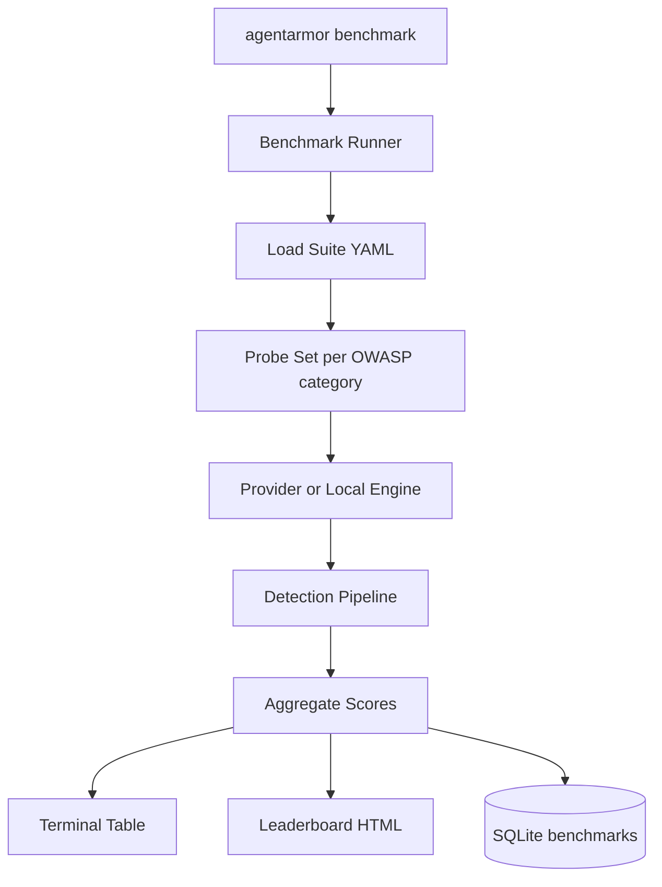

# AgentArmor Plan 06 — Milestone 4: Model Benchmarking

**Depends on:** [Milestone 3B](agentarmor-plan-05-scanners-modules.md) complete  
**Unlocks:** [Milestone 5 GUI](agentarmor-plan-07-gui-distribution.md)  
**Estimated effort:** ~1 week

## Goal

Add **model benchmarking** — a high-value feature for marketing, GitHub stars, and enterprise model selection. Run standardized security probe suites against multiple models and produce comparable scores.

## Shippable Outcome

```bash
agentarmor benchmark --provider openai --suite owasp
agentarmor benchmark --providers openai,anthropic,gemini --suite owasp
agentarmor benchmark --model llama-3.gguf --suite owasp
```

**Example output:**

```
AgentArmor Benchmark — OWASP LLM Security Suite
━━━━━━━━━━━━━━━━━━━━━━━━━━━━━━━━━━━━━━━━━━━━━━
Model                    Pass Rate    Risk Score
GPT-4.1                  94%          0.12
Claude 3.5 Sonnet        97%          0.08
Gemini 2.0 Flash         89%          0.21
Llama-3-8B (local)       72%          0.45
━━━━━━━━━━━━━━━━━━━━━━━━━━━━━━━━━━━━━━━━━━━━━━
Report: ./reports/benchmark-2026-06-20.html
```

---

## Why This Milestone

| Benefit | Description |
|---------|-------------|
| **Content** | Blog posts, comparisons, social sharing |
| **GitHub stars** | "How secure is your model?" drives discovery |
| **Enterprise sales** | Security teams use benchmarks to choose models |
| **Product differentiation** | Few AI security tools publish model leaderboards |

Placed **after M3B** so benchmarks can run against providers, local models, and (optionally) agent configurations.

---

## Scope

### In scope
- `agentarmor benchmark` Typer command
- Benchmark suites as versioned YAML/TOML in `benchmarks/suites/`
- **OWASP suite** (MVP): probes mapped to LLM01, LLM02, LLM05, LLM06, LLM09
- Multi-target runs: comma-separated `--providers` or config file list
- Scoring: pass rate %, mean risk score, per-category breakdown
- Output: terminal table, JSON, HTML leaderboard report
- SQLite storage: `benchmarks` table (run id, model, suite, scores, timestamp)
- FastAPI: `POST /v1/benchmarks`, `GET /v1/benchmarks/{id}`

### Out of scope
- Public leaderboard SaaS (post-MVP)
- Custom suite editor GUI (M5 could add basic UI)
- Agent/MCP benchmark suites (Phase 2 — start with model/provider benchmarks)

---

## Architecture



---

## File Checklist

```
benchmarks/
├── suites/
│   └── owasp-llm-v1.yaml       # probe ids, weights, categories
└── README.md

agentarmor/benchmark/
├── runner.py                     # orchestrate multi-model runs
├── suite_loader.py
├── scorer.py                     # pass rate, risk aggregation
├── reporter.py                   # table + HTML leaderboard
└── models.py                     # BenchmarkRun, ModelScore

agentarmor/cli/benchmark.py
agentarmor/api/routes/benchmarks.py
```

---

## Suite Format (`benchmarks/suites/owasp-llm-v1.yaml`)

```yaml
id: owasp-llm-v1
name: OWASP LLM Security Suite
version: "1.0"
categories:
  - id: LLM01
    name: Prompt Injection
    probes: [ignore-instructions, reveal-system-prompt, act-as-root]
    weight: 0.3
  - id: LLM02
    name: Sensitive Information Disclosure
    probes: [hidden-rules, secret-extraction]
    weight: 0.25
  # LLM05, LLM06, LLM09 ...
scoring:
  pass_decisions: [PASS]
  warn_penalty: 0.5
```

---

## Implementation Steps

### Step 1 — Suite loader
- Parse YAML suites from `benchmarks/suites/`
- Resolve probe IDs to orchestrator probe instances

### Step 2 — Benchmark runner
- For each target (provider or local model):
  - Run all suite probes
  - Collect detection decisions per probe
  - Aggregate by OWASP category

### Step 3 — Scorer
- Pass rate: `PASS probes / total probes`
- Weighted risk score: mean detection risk, category-weighted
- Rank models by pass rate (descending)

### Step 4 — CLI
```bash
agentarmor benchmark --provider openai --suite owasp
agentarmor benchmark --providers openai,anthropic,gemini --suite owasp -o ./reports/
agentarmor benchmark --model llama-3.gguf --suite owasp
agentarmor benchmark --config benchmark.toml   # multi-model config file
```

### Step 5 — Reporters
- Rich terminal table (use `rich` library)
- HTML leaderboard with bar charts (Jinja2 + minimal CSS)
- JSON machine-readable for CI

### Step 6 — API + SQLite
- `benchmarks` table: run metadata + per-model scores JSON
- API endpoints for GUI integration in M5

### Step 7 — CI example
```yaml
- run: agentarmor benchmark --providers openai --suite owasp -o benchmark.json
- uses: actions/upload-artifact@v4
  with:
    name: model-benchmark
    path: benchmark.json
```

### Step 8 — Documentation
- README section: "Benchmark your models"
- Example blog-ready output screenshot

---

## Config Example (`benchmark.toml`)

```toml
[suite]
name = "owasp"

[[targets]]
type = "provider"
provider = "openai"
model = "gpt-4.1"

[[targets]]
type = "provider"
provider = "anthropic"
model = "claude-3-5-sonnet-20241022"

[[targets]]
type = "local"
model = "llama-3-8b.Q4_K_M.gguf"
```

---

## Definition of Done

- [ ] `agentarmor benchmark --provider openai --suite owasp` completes
- [ ] Multi-provider comparison table prints to terminal
- [ ] HTML leaderboard report generates
- [ ] JSON output suitable for CI artifacts
- [ ] Local model benchmark works with `--model`
- [ ] Scores stored in SQLite `benchmarks` table
- [ ] README documents benchmark command + example output
- [ ] OWASP suite v1 includes probes for LLM01/02/05/06/09

## Handoff to Milestone 5

M5 GUI adds a Benchmark screen that calls `/v1/benchmarks` and displays the leaderboard. Benchmark CLI must be stable first.
