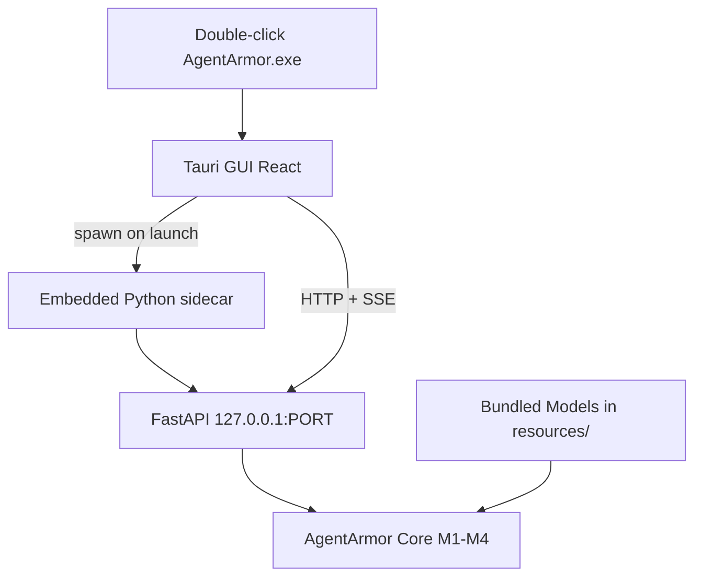

# AgentArmor Plan 07 — Milestone 5: GUI + Distribution

**Depends on:** [Milestone 4 Benchmarking](agentarmor-plan-06-benchmarking.md) complete  
**Unlocks:** Public release (all 5 distribution channels)  
**Estimated effort:** ~2–3 weeks

## Goal

Ship the **Windows desktop product** and **publish all distribution channels**. Users double-click `AgentArmor.exe`, pick a scan type, run offline, export reports. CI users get Docker + published GitHub Action.

## Shippable Outcome

| Artifact | Command / action |
|----------|------------------|
| Windows installer | `AgentArmor-installer.msi` |
| Portable exe | `AgentArmor-portable.exe` |
| PyPI package | `pip install agentarmor` |
| Docker image | `docker pull agentarmor/agentarmor` |
| GitHub Action | `uses: agentarmor/scan@v1` |

Desktop UX: **Double-click → pick API / Local Model / Agent / MCP / RAG → configure → scan → findings → export**

---

## Scope

### In scope

#### Tauri v2 GUI
- React + TypeScript + Tailwind
- **7 screens:** Home picker, Target config, Scan progress, Findings, Reports, **Benchmark**, Settings
- SSE live progress from FastAPI
- Spawns embedded Python sidecar on launch

#### Desktop bundle
```
AgentArmor.exe
├── Tauri GUI
├── Embedded Python 3.12
├── Bundled detection models (ONNX, FAISS, XGBoost)
└── AgentArmor Core
```

- **Installer** (recommended): models + Python to `%ProgramFiles%\AgentArmor\`
- **Portable**: single-folder, no registry (Nuclei / Burp pattern)
- Offline by default; L5 judge toggle in Settings (optional network)

#### Distribution
- PyPI publish with extras: `[local]`, `[dev]`
- Docker image with pre-baked detection models
- Composite GitHub Action `agentarmor/scan@v1` published
- Release CI: build wheels, Docker, Windows artifacts

### Out of scope (post-MVP)
- SaaS dashboard / public leaderboard hosting
- Enterprise platform features
- macOS / Linux desktop installers (architecture supports; ship Windows first)
- Auto-update mechanism

---

## Desktop Architecture



---

## File Checklist

```
gui/
├── package.json
├── src/
│   ├── App.tsx
│   ├── pages/
│   │   ├── Home.tsx
│   │   ├── ScanConfig.tsx
│   │   ├── ScanProgress.tsx
│   │   ├── Findings.tsx
│   │   ├── Reports.tsx
│   │   ├── Benchmark.tsx         # M4 leaderboard UI
│   │   └── Settings.tsx
│   ├── hooks/useScanEvents.ts
│   └── api/client.ts
└── src-tauri/
    ├── tauri.conf.json
    ├── src/main.rs
    └── resources/models/

packaging/
├── embed-python/
├── bundle-models/
├── build-installer.ps1
└── build-portable.ps1

docker/Dockerfile
.github/workflows/release.yml
```

---

## Implementation Steps

### Step 1 — Tauri scaffold
- React + TS + Tailwind; icon, single-instance lock

### Step 2 — Sidecar integration
- Spawn `agentarmor serve --bind 127.0.0.1:{port} --model-dir {bundle_path}`
- Health-check before UI; kill on exit

### Step 3 — GUI screens
1. **Home** — 5 scan tiles + Benchmark shortcut
2. **ScanConfig** — dynamic form per scan type
3. **ScanProgress** — SSE probe events
4. **Findings** — OWASP tags, evidence modal
5. **Reports** — HTML, SARIF, PDF export
6. **Benchmark** — select providers/models + suite → leaderboard chart (from M4 API)
7. **Settings** — portable mode, L5 judge toggle

### Step 4 — API client
- `/v1/scans`, `/v1/findings`, `/v1/benchmarks`
- SSE hook; sidecar error handling

### Step 5 — Embedded Python + bundled models
- python-embed 3.12; agentarmor wheel + maturin L1 wheel
- Models in `resources/models/`; portable `./data/` mode

### Step 6 — Windows builds
- Installer MSI + portable exe; test on clean VM

### Step 7 — Docker + PyPI + GHA publish
- `release.yml` on `v*` tags

### Step 8 — Documentation
- All 5 channels + benchmark examples

---

## Definition of Done

**Desktop:**
- [ ] Double-click opens GUI without manual `pip install`
- [ ] All 5 scan types + benchmark runnable from GUI
- [ ] SSE progress, findings, export HTML/SARIF/PDF
- [ ] Fully offline (judge disabled)
- [ ] Installer + portable tested on Windows

**Distribution:**
- [ ] PyPI, Docker, `agentarmor/scan@v1` published
- [ ] Release workflow on version tags

---

## Full MVP Complete

When M5 passes, the [Master Plan](agentarmor-plan-00-master.md) is complete:

- 6 scan modes + benchmarking
- Full offline detection (bundled in desktop)
- 5 distribution channels
- Plugin system + CI/CD SARIF
- Windows desktop product

**Post-MVP:** macOS/Linux desktop, SaaS leaderboard, OWASP LLM03–10, enterprise features.
